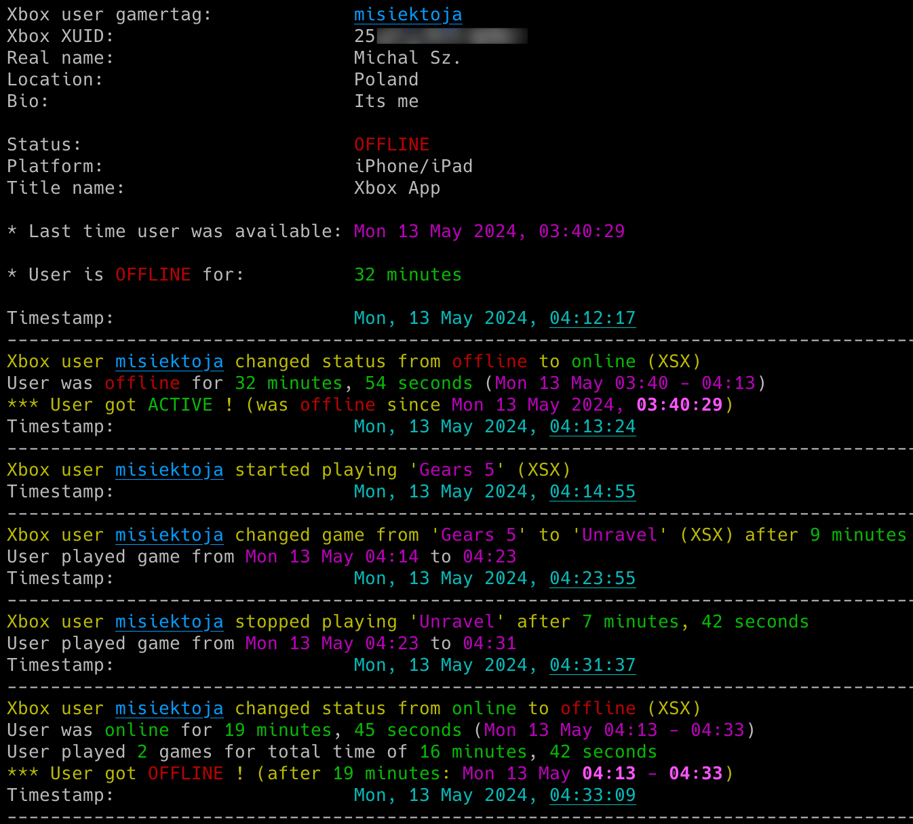
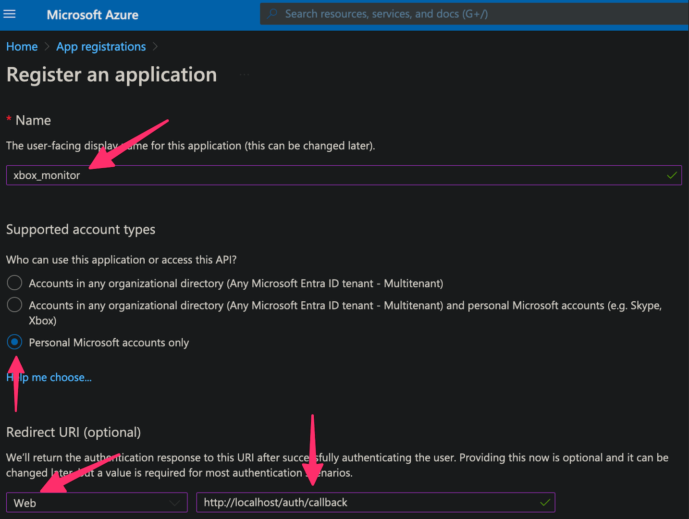
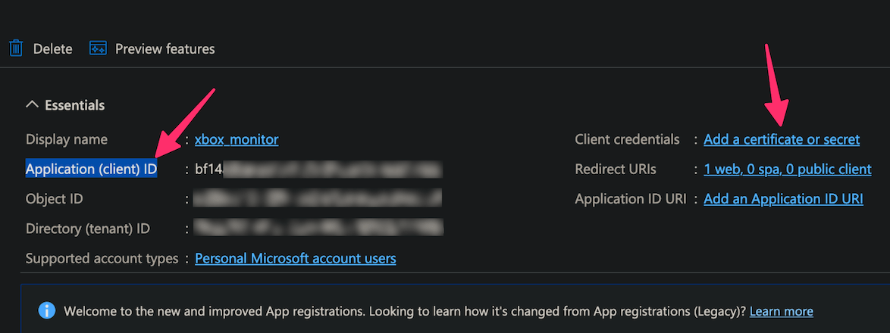
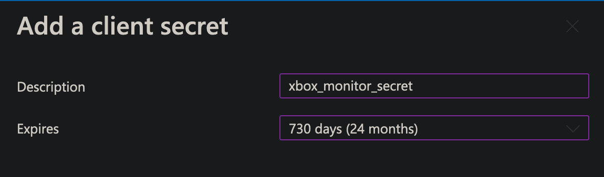
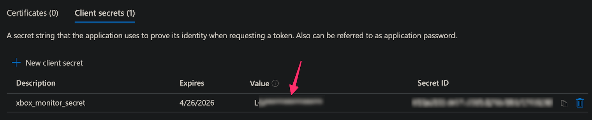
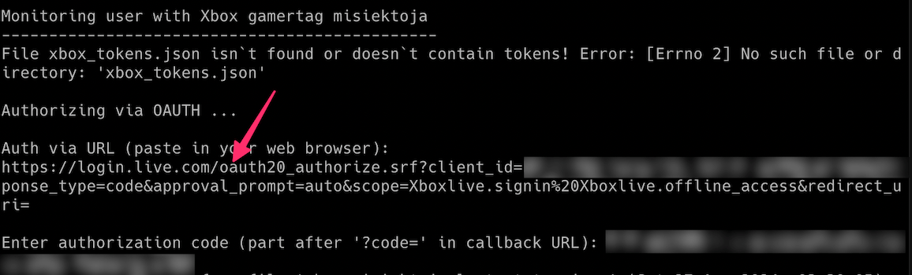
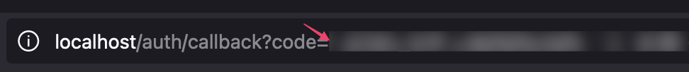
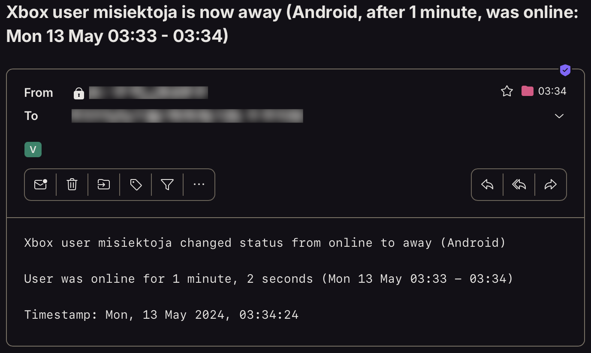

# xbox_monitor

xbox_monitor is a Python script which allows for real-time monitoring of Xbox Live players activity. 

## Features

- Real-time tracking of Xbox Live users gaming activity (including detection when user gets online/offline or played games)
- Basics statistics for user activity (how long in different states, how long played game, overall time and number of played games in the session etc.)
- Email notifications for different events (player gets online/away/offline, starts/finishes/changes game, errors)
- Saving all user activity with timestamps to the CSV file
- Built-in OAuth2 authentication
- Possibility to control the running copy of the script via signals

<p align="center">
   
</p>

## Change Log

Release notes can be found [here](RELEASE_NOTES.md)

## Disclaimer

I'm not a dev, project done as a hobby. Code is ugly and as-is, but it works (at least for me) ;-)

## Requirements

The script requires Python 3.x.

It uses [xbox-webapi](https://github.com/OpenXbox/xbox-webapi-python) library, also requests, pytz, tzlocal, httpx and python-dateutil.

It has been tested successfully on:
- macOS (Ventura & Sonoma)
- Linux (Raspberry Pi Bullseye & Bookworm based on Debian, Ubuntu 24)
- Windows (10 & 11)

It should work on other versions of macOS, Linux, Unix and Windows as well.

## Installation

Install the required Python packages:

```sh
python3 -m pip install requests python-dateutil pytz tzlocal httpx xbox-webapi
```

Or from requirements.txt:

```sh
pip3 install -r requirements.txt
```

Copy the *[xbox_monitor.py](xbox_monitor.py)* file to the desired location. 

You might want to add executable rights if on Linux/Unix/macOS:

```sh
chmod a+x xbox_monitor.py
```

## Configuration

Edit the *[xbox_monitor.py](xbox_monitor.py)* file and change any desired configuration variables in the marked **CONFIGURATION SECTION** (all parameters have detailed description in the comments).

### Azure AD new app registration

Log in to [Azure AD](https://portal.azure.com/#blade/Microsoft_AAD_RegisteredApps/ApplicationsListBlade) and register new app.

- Name your app (e.g. *xbox_monitor*)
- For account type select *"Personal Microsoft accounts only"*
- For redirect URL select *"Web"* type and put: *http://localhost/auth/callback*

<p align="center">
   
</p>

Then copy value of *'Application (client) ID'* to **MS_APP_CLIENT_ID** variable (or use **-u** parameter).

Then next to *'Client credentials'* click *'Add a certificate or secret'*.

<p align="center">
   
</p>

Add a new client secret with long expiration date (like 2 years) and some description (e.g. *xbox_monitor_secret*).

<p align="center">
   
</p>

Copy the contents from 'Value' column to **MS_APP_CLIENT_SECRET** variable (or use **-w** parameter).

<p align="center">
   
</p>

After performing authentication the token will be saved into a file, type its location and name in **MS_AUTH_TOKENS_FILE** (or use default *xbox_tokens.json* - it will be saved in your currently working dir).

### Timezone

The tool will try to automatically detect your local time zone so it can convert Xbox API timestamps to your time. 

In case you want to specify your timezone manually then change **LOCAL_TIMEZONE** variable from *'Auto'* to specific location, e.g.

```
LOCAL_TIMEZONE='Europe/Warsaw'
```

In such case it is not needed to install *tzlocal* pip module.

### User privacy settings

In order to monitor Xbox user activity, proper privacy settings need to be enabled on the monitored user account, i.e. in [Xbox profile privacy & online safety settings](https://account.xbox.com/Settings), the value in section *'Others can see if you're online'* (and preferably also *'Others can see your Xbox profile details'*) should be set to *'Friends'* (if you are friends) or to *'Everyone'*. 

### SMTP settings

If you want to use email notifications functionality you need to change the SMTP settings (host, port, user, password, sender, recipient). If you leave the default settings then no notifications will be sent.

### Other settings

All other variables can be left at their defaults, but feel free to experiment with it.

## Getting started

### List of supported parameters

To get the list of all supported parameters:

```sh
./xbox_monitor.py -h
```

or 

```sh
python3 ./xbox_monitor.py -h
```

### Monitoring mode

To monitor specific user activity, just type the player's Xbox Live gamer tag (**misiektoja** in the example below):

```sh
./xbox_monitor.py misiektoja
```

If you have not changed **MS_APP_CLIENT_ID** & **MS_APP_CLIENT_SECRET** variables in the *[xbox_monitor.py](xbox_monitor.py)* file, you can use **-u** and **-w** parameters:

```sh
./xbox_monitor.py misiektoja -u "your_ms_application_client_id" -w "your_ms_application_secret_value"
```

The first time the tool is run it will perform OAuth2 authentication using the data you provided.

It will generate a URL you need to paste in your web browser and authorize the tool.

<p align="center">
   
</p>

The request in your web browser will be redirected to localhost, you will get an error that it cannot connect, ignore it and just copy the part after *'?code='* in callback URL and paste in the tool.

<p align="center">
   
</p>

The tool will save the token to a file specified in **MS_AUTH_TOKENS_FILE** variable, so it can be reused in case the tool is restarted (with no need to authenticate again).

The tool will run infinitely and monitor the player until the script is interrupted (Ctrl+C) or killed the other way.

You can monitor multiple Xbox Live players by spawning multiple copies of the script. 

It is suggested to use sth like **tmux** or **screen** to have the script running after you log out from the server (unless you are running it on your desktop).

The tool automatically saves its output to *xbox_monitor_{gamertag}.log* file (can be changed in the settings via **XBOX_LOGFILE** variable or disabled completely with **-d** parameter).

The tool also saves the timestamp and last status (after every change) to *xbox_{gamertag}_last_status.json* file, so the last status is available after the restart of the tool.

## How to use other features

### Email notifications

If you want to get email notifications once the user gets online or offline use **-a** parameter:

```sh
./xbox_monitor.py misiektoja -a
```

Make sure you defined your SMTP settings earlier (see [SMTP settings](#smtp-settings)).

If you want to be informed when user starts, stops or changes the played game then use **-g** parameter:

```sh
./xbox_monitor.py misiektoja -g
```

If you also want to be informed about any user status changes (online/away/offline) use **-s** parameter (note: away status seems to be reported only by Xbox App on Android devices):

```sh
./xbox_monitor.py misiektoja -s
```

Example email:

<p align="center">
   
</p>

### Saving activity to the CSV file

If you want to save all reported activities of the Xbox Live user, use **-b** parameter with the name of the file (it will be automatically created if it does not exist):

```sh
./xbox_monitor.py misiektoja -b xbox_misiektoja.csv
```

### Check intervals

If you want to change the check interval when the user is online or away to 30 seconds use **-k** parameter and when the user is offline to 2 mins (120 seconds) use **-c** parameter:

```sh
./xbox_monitor.py misiektoja -k 30 -c 120
```

### Controlling the script via signals (only macOS/Linux/Unix)

The tool has several signal handlers implemented which allow to change behavior of the tool without a need to restart it with new parameters.

List of supported signals:

| Signal | Description |
| ----------- | ----------- |
| USR1 | Toggle email notifications when user gets online or offline (-a) |
| USR2 | Toggle email notifications when user starts/stops/changes the game (-g) |
| CONT | Toggle email notifications for all user status changes (online/away/offline) (-s) |
| TRAP | Increase the check timer for player activity when user is online (by 30 seconds) |
| ABRT | Decrease check timer for player activity when user is online (by 30 seconds) |

So if you want to change functionality of the running tool, just send the proper signal to the desired copy of the script.

I personally use **pkill** tool, so for example to toggle email notifications when user gets online or offline, for the tool instance monitoring the *misiektoja* user:

```sh
pkill -f -USR1 "python3 ./xbox_monitor.py misiektoja"
```

As Windows supports limited number of signals, this functionality is available only on Linux/Unix/macOS.

### Other

Check other supported parameters using **-h**.

You can combine all the parameters mentioned earlier.

## Coloring log output with GRC

If you use [GRC](https://github.com/garabik/grc) and want to have the tool's log output properly colored you can use the configuration file available [here](grc/conf.monitor_logs)

Change your grc configuration (typically *.grc/grc.conf*) and add this part:

```
# monitoring log file
.*_monitor_.*\.log
conf.monitor_logs
```

Now copy the *conf.monitor_logs* to your *.grc* directory and xbox_monitor log files should be nicely colored when using *grc* tool.

## License

This project is licensed under the GPLv3 - see the [LICENSE](LICENSE) file for details
